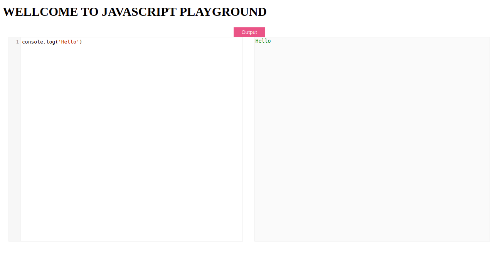

# javascriptPlayground
[For Demo Please Click here](https://bashutosh.github.io/javascriptPlayground/)

This is a basic javascript playground developed in Javascript. CodeMirror package is used in implementing the code editor for the plaground.

## Contributing
Pull requests are welcome. For major changes, please open an [issue](https://github.com/bashutosh/javascriptPlayground/issues) first to discuss what you would like to change.

## License
[MIT](https://choosealicense.com/licenses/mit/)

